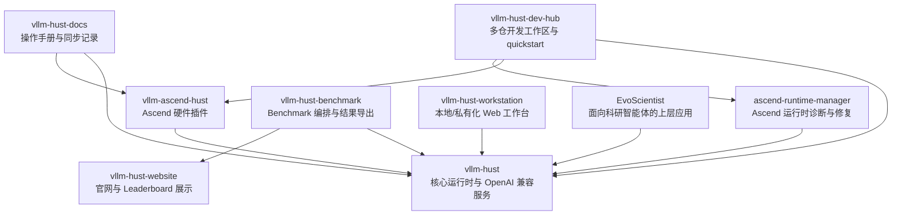

# vLLM-HUST

国产算力友好的 vLLM fork 组织，围绕推理运行时、Ascend 使能、开发工作区、Benchmark、Website 与 AI 应用集成构建完整工程链路。

## 我们在做什么

`vLLM-HUST` 以上游 `vLLM` 生态为基础，重点面向下面几类工作：

- 保持与上游 `vLLM` / `vLLM Ascend` 的兼容与可持续同步
- 支持 Ascend 等国产硬件上的推理与部署
- 强化 AGI4S 场景，包括长上下文、工具调用、结构化输出与服务稳定性
- 提供从开发工作区到 Website、Benchmark、Workstation 的完整配套仓库

## 组织仓库关系

## 仓库地图

### 核心运行时

- [vllm-hust](https://github.com/vLLM-HUST/vllm-hust)
  基于上游 `vLLM` 的主运行时 fork，是整个组织的核心仓库，负责推理引擎、OpenAI 兼容服务、CLI 与主要 CI。

- [vllm-ascend-hust](https://github.com/vLLM-HUST/vllm-ascend-hust)
  `vllm-hust` 的 Ascend 插件与本地化发行仓库，遵循上游硬件插件模式，尽量把硬件相关逻辑隔离在插件层。

- [ascend-runtime-manager](https://github.com/vLLM-HUST/ascend-runtime-manager)
  独立的 Ascend 运行时修复与诊断工具，负责环境探测、容器化部署、依赖修复与 Python 栈对齐。

### 工程与开发体验

- [vllm-hust-dev-hub](https://github.com/vLLM-HUST/vllm-hust-dev-hub)
  多仓开发入口，提供 VS Code workspace、quickstart、clone 脚本与自托管 CI 相关工具。

- [vllm-hust-docs](https://github.com/vLLM-HUST/vllm-hust-docs)
  组织级文档仓库，用于放置部署手册、兼容性说明、上游同步记录和团队操作指南。

### 验证、展示与应用层

- [vllm-hust-benchmark](https://github.com/vLLM-HUST/vllm-hust-benchmark)
  `vllm-hust` benchmark 的稳定包装层，负责场景编排、结果导出和与 Website 的对接。

- [vllm-hust-website](https://github.com/vLLM-HUST/vllm-hust-website)
  官网、Leaderboard 与演示入口，展示组织介绍、版本信息和 Benchmark 结果快照。

- [vllm-hust-workstation](https://github.com/vLLM-HUST/vllm-hust-workstation)
  面向终端用户的 Web 工作站，提供统一推理入口、可视化控制台与 EvoScientist 嵌入能力。

- [EvoScientist](https://github.com/vLLM-HUST/EvoScientist)
  面向科研工作流的智能体应用，可把 `vllm-hust` 作为底层推理与工具调用后端。

## 推荐理解顺序

如果你第一次进入 `vLLM-HUST` 组织，推荐按这个顺序理解：

1. 从 [vllm-hust](https://github.com/vLLM-HUST/vllm-hust) 开始，理解核心运行时与服务接口。
2. 如果你关注 Ascend 或国产硬件，再看 [vllm-ascend-hust](https://github.com/vLLM-HUST/vllm-ascend-hust) 与 [ascend-runtime-manager](https://github.com/vLLM-HUST/ascend-runtime-manager)。
3. 如果你要搭本地开发环境，直接使用 [vllm-hust-dev-hub](https://github.com/vLLM-HUST/vllm-hust-dev-hub)。
4. 如果你要做结果展示或性能验证，再看 [vllm-hust-benchmark](https://github.com/vLLM-HUST/vllm-hust-benchmark) 与 [vllm-hust-website](https://github.com/vLLM-HUST/vllm-hust-website)。
5. 如果你关注最终用户体验或上层应用，再看 [vllm-hust-workstation](https://github.com/vLLM-HUST/vllm-hust-workstation) 与 [EvoScientist](https://github.com/vLLM-HUST/EvoScientist)。

## 与上游的关系

`vLLM-HUST` 不是从零开始的新推理栈，而是围绕上游项目进行工程化增强：

- 上游运行时参考：`vllm-project/vllm`
- 上游 Ascend 插件参考：`vllm-project/vllm-ascend`
- 相关比较与生态参考：`sgl-project/sglang`

组织内仓库默认优先保持可维护、可同步、可验证，而不是无边界地与上游分叉。

## 开始贡献

- 想要改运行时或服务链路：从 [vllm-hust](https://github.com/vLLM-HUST/vllm-hust) 开始
- 想要改 Ascend 支持：从 [vllm-ascend-hust](https://github.com/vLLM-HUST/vllm-ascend-hust) 和 [ascend-runtime-manager](https://github.com/vLLM-HUST/ascend-runtime-manager) 开始
- 想要快速拉起完整开发环境：使用 [vllm-hust-dev-hub](https://github.com/vLLM-HUST/vllm-hust-dev-hub)
- 想要补文档、操作流程、同步记录：前往 [vllm-hust-docs](https://github.com/vLLM-HUST/vllm-hust-docs)

欢迎通过 issue、pull request 和 benchmark / deployment 反馈一起完善这个组织。