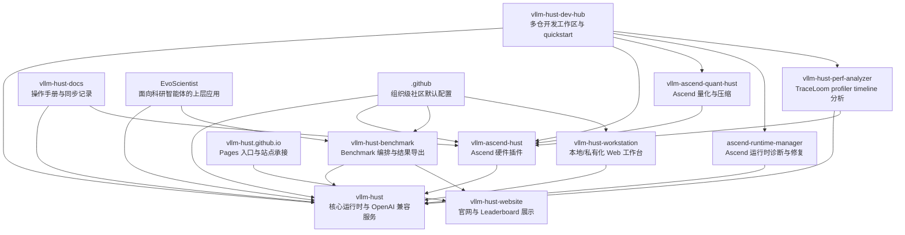

# vLLM-HUST

国产算力友好的 vLLM fork 组织，围绕推理运行时、Ascend 使能、量化工具、性能分析、开发工作区、Benchmark、Website 与 AI 应用集成构建完整工程链路。

An upstream-compatible vLLM fork organization focused on domestic-hardware enablement, Ascend support, AGI4S serving, quantization tooling, performance analysis, benchmark-driven validation, and a practical multi-repository developer experience.

## Quick Links

- Core runtime: [vllm-hust](https://github.com/vLLM-HUST/vllm-hust)
- Ascend plugin: [vllm-ascend-hust](https://github.com/vLLM-HUST/vllm-ascend-hust)
- Ascend quantization: [vllm-ascend-quant-hust](https://github.com/vLLM-HUST/vllm-ascend-quant-hust)
- Runtime manager: [ascend-runtime-manager](https://github.com/vLLM-HUST/ascend-runtime-manager)
- Dev workspace: [vllm-hust-dev-hub](https://github.com/vLLM-HUST/vllm-hust-dev-hub)
- Benchmark wrapper: [vllm-hust-benchmark](https://github.com/vLLM-HUST/vllm-hust-benchmark)
- Performance analyzer: [vllm-hust-perf-analyzer](https://github.com/vLLM-HUST/vllm-hust-perf-analyzer)
- Website: [vllm-hust-website](https://github.com/vLLM-HUST/vllm-hust-website)
- Workstation: [vllm-hust-workstation](https://github.com/vLLM-HUST/vllm-hust-workstation)
- Docs: [vllm-hust-docs](https://github.com/vLLM-HUST/vllm-hust-docs)
- Research app: [EvoScientist](https://github.com/vLLM-HUST/EvoScientist)
- Community defaults: [.github](https://github.com/vLLM-HUST/.github)
- Pages entry: [vllm-hust.github.io](https://github.com/vLLM-HUST/vllm-hust.github.io)

## Fork Status

组织两个核心 fork 仓库持续吸收上游 commit 并叠加自研改动，版本号由「对齐的上游版本 + fork 额外提交数」自动生成。

> Snapshot: `2026-06-05`

| Repository | Upstream aligned to | Fork-only commits | Net insertions | Key areas |
| --- | --- | ---: | ---: | --- |
| `vllm-hust` | **v0.20.1rc0** (vllm) | 288 | +16,241 | unified comm, perf patches, Ascend CI, structured output, attention |
| `vllm-ascend-hust` | **v0.19.1rc1** (vllm-ascend) | 210 | +17,399 | EPLB scheduling, model_runner perf, kv-transfer, aclgraph, CI/benchmark |

### vllm-hust 改动分类

| Category | Commits | Highlights |
| --- | ---: | --- |
| Performance | 10 | kv-cache fit skip, logprobs materialization, pooling tolist, async sampling, v1 hot paths |
| Features | 6 | unified_comm abstraction + GroupCoordinator integration, attention CPU mirrors, kv scale batch, structured output cache metrics |
| Engine fixes | 39 | whisper staged token, encoder-decoder beam reuse, structured output compilation, attention split |
| CI / DevOps | 74 | Ascend benchmark infra, pre-commit hardening, versioning metadata |
| Tests | 3 | worker, attention, structured output coverage |
| Docs & chore | 24 | contributing guide, release policy, dep alignment |

### vllm-ascend-hust 改动分类

| Category | Commits | Highlights |
| --- | ---: | --- |
| Performance | 4 | EPLB control-plane overhead, DP metadata sync buffer reuse, oproj all_to_all recv reuse, kv-transfer debug guard |
| Features | 4 | unified preempt victim selector (BidKV utility), aclgraph operator optimization, same-spec benchmark, local Ascend helpers |
| Engine fixes | 34 | speculative decoding fallback, slot mapping, runtime visibility, sampling op guard |
| CI / DevOps | 102 | benchmark root helper, sudo entrypoint, leaderboard snapshot, PR smart test |
| Tests | 2 | EPLB policy, attention |
| Docs & chore | 17 | speculative decoding limitations, changelog, versioning policy |

### 版本号格式

```
{upstream_version}.post1.dev{fork_commits}+g{short_sha}
```

例如 `vllm-hust` 当前版本为 `0.20.1.post1.dev288+g2206f1f7b`，表示：对齐上游 `v0.20.1rc0`，在此之上有 288 个 fork 独有提交。

---

## What We Build

`vLLM-HUST` 以上游 `vLLM` 生态为基础，重点面向下面几类工作：

- 保持与上游 `vLLM` / `vLLM Ascend` 的兼容与可持续同步
- 支持 Ascend 等国产硬件上的推理与部署
- 支持 Ascend NPU 上的后训练量化与 profiler timeline 离线分析
- 强化 AGI4S 场景，包括长上下文、工具调用、结构化输出与服务稳定性
- 提供从开发工作区到 Website、Benchmark、Workstation 的完整配套仓库

In practice, the organization concentrates on four goals:

- keep `vllm-hust` mergeable with upstream `vllm` whenever possible
- isolate hardware-specific logic in plugins, managers, and deployment tooling
- validate runtime behavior with real benchmarks, profile analysis, smoke tests, and website-facing artifacts
- connect low-level serving infrastructure to end-user and research-facing products

<!-- contributor-leaderboard:start -->
## 贡献者排行榜

> 身份合并规则与统计方法详见 [CONTRIBUTORS.md](../CONTRIBUTORS.md)

### 组织全仓库

统计组织下 9 个仓库的 fork-only 贡献（fork 仓库去除上游 commit，其他仓库全量计入，单次 commit >50k 行视为批量导入排除），快照 `2026-06-05`。

| Rank | Contributor | Commits | Changed lines | Added / Deleted | Active repos |
| --- | --- | ---: | ---: | ---: | ---: |
| 1 | [Shuhao Zhang](https://github.com/ShuhaoZhangTony) | 466 | 194,227 | +131,415 / -62,812 | 7 |
| 2 | [MingqiWang-coder](https://github.com/MingqiWang-coder) | 38 | 21,449 | +7,608 / -13,841 | 2 |
| 3 | [Jingyuan Tian](https://github.com/CubeLander) | 5 | 12,740 | +12,495 / -245 | 1 |
| 4 | [Xiling Gao](https://github.com/XilingGao) | 5 | 12,538 | +12,305 / -233 | 1 |
| 5 | [moonandlife](https://github.com/moonandlife) | 37 | 8,285 | +6,780 / -1,505 | 4 |
| 6 | [KimmoZAG](https://github.com/KimmoZAG) | 6 | 6,244 | +4,759 / -1,485 | 2 |
| 7 | [iliujunn](https://github.com/iliujunn) | 5 | 1,538 | +655 / -883 | 1 |
| 8 | [Remygred](https://github.com/Remygred) | 1 | 276 | +230 / -46 | 1 |
| 9 | [aly16-k](https://github.com/aly16-k) | 2 | 225 | +225 / -0 | 1 |
| 10 | [pygone](https://github.com/Pygone) | 1 | 187 | +164 / -23 | 1 |

---

### 核心性能仓库

仅统计直接影响推理性能的 3 个核心仓库（`vllm-ascend-hust`, `vllm-ascend-quant-hust`, `vllm-hust`），排除所有上游/初始代码，快照 `2026-06-05`。

| Rank | Contributor | Commits | Changed lines | Added / Deleted | Active repos |
| --- | --- | ---: | ---: | ---: | ---: |
| 1 | [Shuhao Zhang](https://github.com/ShuhaoZhangTony) | 73 | 10,681 | +8,814 / -1,867 | 2 |
| 2 | [Remygred](https://github.com/Remygred) | 1 | 276 | +230 / -46 | 1 |
| 3 | [aly16-k](https://github.com/aly16-k) | 2 | 225 | +225 / -0 | 1 |
| 4 | [moonandlife](https://github.com/moonandlife) | 2 | 4 | +2 / -2 | 1 |

<!-- contributor-leaderboard:end -->

## 组织仓库关系


```mermaid
flowchart TD
    A[vllm-hust\n核心运行时与 OpenAI 兼容服务]
    B[vllm-ascend-hust\nAscend 硬件插件]
    C[vllm-ascend-quant-hust\nAscend 量化与压缩]
    D[ascend-runtime-manager\nAscend 运行时诊断与修复]
    E[vllm-hust-dev-hub\n多仓开发工作区与 quickstart]
    F[vllm-hust-benchmark\nBenchmark 编排与结果导出]
    G[vllm-hust-website\n官网与 Leaderboard 展示]
    H[vllm-hust-workstation\n本地/私有化 Web 工作台]
    I[vllm-hust-docs\n操作手册与同步记录]
    J[EvoScientist\n面向科研智能体的上层应用]
    K[.github\n组织级社区默认配置]
    L[vllm-hust.github.io\nPages 入口与站点承接]
    M[vllm-hust-perf-analyzer\nTraceLoom profiler timeline 分析]

    B --> A
    C --> B
    D --> A
    E --> A
    E --> B
    E --> C
    E --> D
    E --> M
    F --> A
    F --> G
    H --> A
    I --> A
    I --> B
    J --> A
    J --> F
    K --> A
    K --> B
    K --> F
    K --> H
    L --> G
    M --> A
    M --> B
```

## 仓库地图

### Repository Map At A Glance

| Repository | Primary role | Depends on / connects to |
| --- | --- | --- |
| `vllm-hust` | core inference runtime and serving fork | upstream `vllm`, benchmark, workstation, plugin |
| `vllm-ascend-hust` | Ascend hardware plugin | `vllm-hust`, upstream `vllm-ascend` |
| `vllm-ascend-quant-hust` | post-training quantization tooling for Ascend NPUs | `vllm-ascend-hust`, Ascend/CANN quantization stack |
| `ascend-runtime-manager` | runtime repair and deployment tooling | `vllm-hust`, `vllm-ascend-hust` |
| `vllm-hust-dev-hub` | multi-repo workspace and bootstrap | all local sibling repos |
| `vllm-hust-benchmark` | benchmark orchestration and export | `vllm-hust`, `vllm-hust-website`, `EvoScientist` workload traces |
| `vllm-hust-perf-analyzer` | TraceLoom offline profiler timeline analysis | `vllm-hust`, `vllm-ascend-hust`, profiler outputs |
| `vllm-hust-website` | landing page and leaderboard snapshots | benchmark exports, workstation embeds |
| `vllm-hust-workstation` | user-facing web console | `vllm-hust`, EvoScientist |
| `vllm-hust-docs` | operations, sync notes, internal docs | runtime and plugin repos |
| `EvoScientist` | higher-level research agent product | `vllm-hust` APIs and tools, trace → benchmark |
| `.github` | org-level community health defaults | shared issue templates, PR template, security policy |
| `vllm-hust.github.io` | Pages entry and site handoff repo | website publishing and org-facing landing path |

### 核心运行时

- [vllm-hust](https://github.com/vLLM-HUST/vllm-hust)
  基于上游 `vLLM` 的主运行时 fork，是整个组织的核心仓库，负责推理引擎、OpenAI 兼容服务、CLI 与主要 CI。

- [vllm-ascend-hust](https://github.com/vLLM-HUST/vllm-ascend-hust)
  `vllm-hust` 的 Ascend 插件与本地化发行仓库，遵循上游硬件插件模式，尽量把硬件相关逻辑隔离在插件层。

- [vllm-ascend-quant-hust](https://github.com/vLLM-HUST/vllm-ascend-quant-hust)
  面向 Ascend NPU 的后训练量化工具仓库，覆盖 8-bit、4-bit 与混合精度量化路径，服务于本地化模型压缩与部署验证。

- [ascend-runtime-manager](https://github.com/vLLM-HUST/ascend-runtime-manager)
  独立的 Ascend 运行时修复与诊断工具，负责环境探测、容器化部署、依赖修复与 Python 栈对齐。

### 工程与开发体验

- [vllm-hust-dev-hub](https://github.com/vLLM-HUST/vllm-hust-dev-hub)
  多仓开发入口，提供 VS Code workspace、quickstart、clone 脚本与自托管 CI 相关工具。

- [vllm-hust-docs](https://github.com/vLLM-HUST/vllm-hust-docs)
  组织级文档仓库，用于放置部署手册、兼容性说明、上游同步记录和团队操作指南。

### 验证、展示与应用层

- [vllm-hust-benchmark](https://github.com/vLLM-HUST/vllm-hust-benchmark)
  `vllm-hust` benchmark 的稳定包装层，负责场景编排、结果导出和与 Website 的对接。已集成 EvoScientist 智能体轨迹作为 `agent-research-online` workload（32 轮多阶段研究交互）。

- [vllm-hust-perf-analyzer](https://github.com/vLLM-HUST/vllm-hust-perf-analyzer)
  TraceLoom 离线性能分析工具，消费 CUDA/Nsight 或 Ascend/CANN profiler timeline，恢复语义循环、通信结构与成本摘要。

- [vllm-hust-website](https://github.com/vLLM-HUST/vllm-hust-website)
  官网、Leaderboard 与演示入口，展示组织介绍、版本信息和 Benchmark 结果快照。

- [vllm-hust-workstation](https://github.com/vLLM-HUST/vllm-hust-workstation)
  面向终端用户的 Web 工作站，提供统一推理入口、可视化控制台与 EvoScientist 嵌入能力。

- [EvoScientist](https://github.com/vLLM-HUST/EvoScientist)
  面向科研工作流的智能体应用，可把 `vllm-hust` 作为底层推理与工具调用后端，其多智能体轨迹已回流为 `vllm-hust-benchmark` 的 agent workload 场景。

### 组织与发布支撑

- [.github](https://github.com/vLLM-HUST/.github)
  组织级 profile 与 community health 仓库，承载公共 issue 模板、PR 模板、安全策略和首页说明文案。

- [vllm-hust.github.io](https://github.com/vLLM-HUST/vllm-hust.github.io)
  GitHub Pages 入口仓库，用于承接组织级页面发布路径和静态站点入口配置。

## 推荐理解顺序

如果你第一次进入 `vLLM-HUST` 组织，推荐按这个顺序理解：

1. 从 [vllm-hust](https://github.com/vLLM-HUST/vllm-hust) 开始，理解核心运行时与服务接口。
2. 如果你关注 Ascend 或国产硬件，再看 [vllm-ascend-hust](https://github.com/vLLM-HUST/vllm-ascend-hust)、[ascend-runtime-manager](https://github.com/vLLM-HUST/ascend-runtime-manager) 与 [vllm-ascend-quant-hust](https://github.com/vLLM-HUST/vllm-ascend-quant-hust)。
3. 如果你要搭本地开发环境，直接使用 [vllm-hust-dev-hub](https://github.com/vLLM-HUST/vllm-hust-dev-hub)。
4. 如果你要做结果展示、性能验证或 profiler 分析，再看 [vllm-hust-benchmark](https://github.com/vLLM-HUST/vllm-hust-benchmark)、[vllm-hust-perf-analyzer](https://github.com/vLLM-HUST/vllm-hust-perf-analyzer) 与 [vllm-hust-website](https://github.com/vLLM-HUST/vllm-hust-website)。
5. 如果你关注最终用户体验或上层应用，再看 [vllm-hust-workstation](https://github.com/vLLM-HUST/vllm-hust-workstation) 与 [EvoScientist](https://github.com/vLLM-HUST/EvoScientist)。

For English-speaking contributors, the same reading order applies:

1. Start with `vllm-hust` for the runtime and serving surface.
2. Move to `vllm-ascend-hust`, `ascend-runtime-manager`, and `vllm-ascend-quant-hust` for Ascend-specific support.
3. Use `vllm-hust-dev-hub` for the intended multi-repo development workflow.
4. Read `vllm-hust-benchmark`, `vllm-hust-perf-analyzer`, and `vllm-hust-website` for validation, profiler analysis, and result publication.
5. Finish with `vllm-hust-workstation` and `EvoScientist` for user-facing and research-facing applications.

## 与上游的关系

`vLLM-HUST` 不是从零开始的新推理栈，而是围绕上游项目进行工程化增强：

- 上游运行时参考：`vllm-project/vllm`
- 上游 Ascend 插件参考：`vllm-project/vllm-ascend`
- 相关比较与生态参考：`sgl-project/sglang`

组织内仓库默认优先保持可维护、可同步、可验证，而不是无边界地与上游分叉。

## 开始贡献

- 想要改运行时或服务链路：从 [vllm-hust](https://github.com/vLLM-HUST/vllm-hust) 开始
- 想要改 Ascend 支持：从 [vllm-ascend-hust](https://github.com/vLLM-HUST/vllm-ascend-hust) 和 [ascend-runtime-manager](https://github.com/vLLM-HUST/ascend-runtime-manager) 开始
- 想要改量化或 profiler 分析：从 [vllm-ascend-quant-hust](https://github.com/vLLM-HUST/vllm-ascend-quant-hust) 和 [vllm-hust-perf-analyzer](https://github.com/vLLM-HUST/vllm-hust-perf-analyzer) 开始
- 想要快速拉起完整开发环境：使用 [vllm-hust-dev-hub](https://github.com/vLLM-HUST/vllm-hust-dev-hub)
- 想要补文档、操作流程、同步记录：前往 [vllm-hust-docs](https://github.com/vLLM-HUST/vllm-hust-docs)

欢迎通过 issue、pull request 和 benchmark / deployment 反馈一起完善这个组织。

## Community Defaults

This organization also uses this repository for shared community health files:

- default issue templates
- default pull request template
- shared security policy
- shared code of conduct

If a specific repository does not override those files, GitHub will fall back to the defaults provided here.
